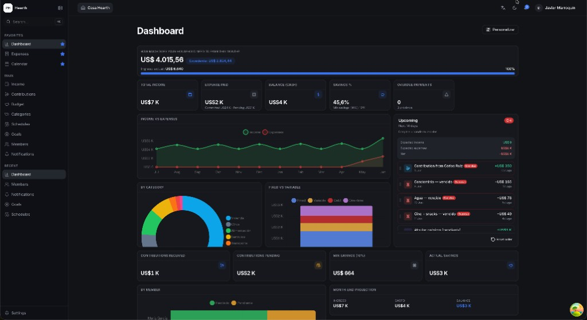
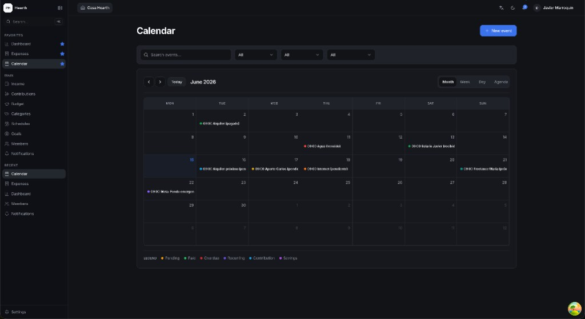
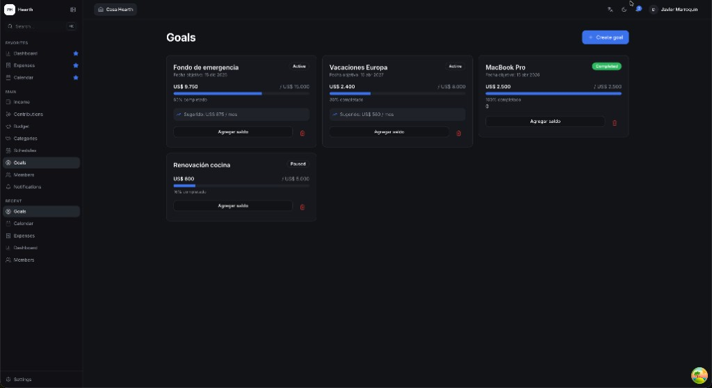

# Open Hearth Budget

**Self-hosted collaborative household budgeting** — track income, expenses, member contributions, and savings goals in one place.

Answer one question every month: **how much does your household need to earn to cover living costs, obligations, and at least 10% savings?**

Bilingual UI (**English** + **Spanish**) via i18next.

[](./LICENSE)

---

## Screenshots

<p align="center">
  <a href="./docs/screenshots/dashboard.png">
    
  </a>
  <br />
  <sub><strong>Dashboard</strong> — customizable KPIs, charts, and a 14-day upcoming timeline (paid, pending, and overdue)</sub>
</p>

<p align="center">
  <a href="./docs/screenshots/calendar.png">
    
  </a>
  &nbsp;
  <a href="./docs/screenshots/goals.png">
    
  </a>
  <br />
  <sub><strong>Calendar</strong> &nbsp;·&nbsp; <strong>Savings goals</strong></sub>
</p>

> Demo data: `npm run db:seed:demo` → login `demo@local.dev` / `demo1234` → household **Casa Hearth**

---

## Features

- **Households** — multi-user workspaces with roles (admin, family, tenant, guest)
- **Dashboard** — customizable KPI widgets, drag-and-drop layout, upcoming timeline
- **Income & expenses** — categories, splits, statuses, CSV export
- **Contributions** — track expected member payments
- **Calendar** — month / week / day / agenda views for bills and events
- **Savings goals** — targets with monthly savings suggestions
- **Envelope budgeting** — zero-sum category envelopes (optional mode)
- **Recurring schedules** — fixed income and expenses on autopilot
- **Members & invites** — email invitations, self-hosted auth
- **Import / export** — CSV backup and restore ([docs](./docs/IMPORT_EXPORT.md))
- **PWA-ready** — installable web app, light / dark / system theme

---

## Stack

| Layer | Technology |
|-------|------------|
| Frontend | React 18, TypeScript, Vite 5, React Router |
| UI | Tailwind CSS, shadcn/ui, Radix UI |
| State | Zustand (UI) + TanStack Query (server) |
| Forms | React Hook Form + Zod |
| Charts / calendar | Chart.js, FullCalendar |
| i18n | react-i18next (English + Spanish) |
| Backend | **PostgreSQL 16** + **Hono** API (`server/`) |
| Auth | Email + password, session cookie |
| Tests | Vitest (unit), Playwright (E2E) |

Everything runs from this repository (PostgreSQL + Hono API).

---

## Quick start

### Option A — Docker (recommended)

```bash
git clone https://github.com/javier-marroquin/hearth-budget.git
cd hearth-budget
chmod +x scripts/install.sh
npm run install:self-hosted
```

Then in **two terminals**:

```bash
npm run dev:api    # terminal 1 — API on :3000
npm run dev        # terminal 2 — app on :5173
```

| Service | URL |
|---------|-----|
| Web app | http://localhost:5173 |
| API health | http://localhost:3000/api/health |
| Mailpit (dev email) | http://localhost:8025 |
| PostgreSQL | `localhost:5432` |

### Option B — Local PostgreSQL (no Docker)

```bash
npm install
npm run db:setup-local   # creates DB, updates .env
npm run db:migrate
npm run db:seed
npm run dev:api          # terminal 1
npm run dev              # terminal 2
```

**Demo user** (when `SEED_DEMO_USER=true`):

- Email: `demo@local.dev`
- Password: `demo1234`
- Rich sample data (screenshots above): `npm run db:seed:demo`

Full install guide: **[INSTALL.md](./INSTALL.md)**

---

## Environment

Copy `.env.example` to `.env` (or let `install:self-hosted` / `db:setup-local` create it). Minimum:

```env
DATABASE_URL=postgres://user@localhost:5432/household_budget
AUTH_SECRET=change-me-min-16-characters
VITE_API_URL=http://localhost:3000
```

See [INSTALL.md](./INSTALL.md) for email (Resend), demo seed, and production notes.

---

## Scripts

| Command | Description |
|---------|-------------|
| `npm run dev` | Frontend dev server |
| `npm run dev:api` | Hono API dev server |
| `npm run dev:stack` | Docker DB + Mailpit, migrate, API |
| `npm run build` | Production build |
| `npm run typecheck` | TypeScript check |
| `npm test` | Unit tests (Vitest) |
| `npm run e2e` | E2E tests (Playwright) |

---

## Project structure

```
hearth-budget/
├── server/              # Hono API (auth, CRUD, KPIs, invites, backup)
├── db/migrations/       # PostgreSQL SQL migrations
├── scripts/             # install.sh, setup-local-db.sh
├── src/
│   ├── app/             # Router, providers, shell
│   ├── components/      # UI primitives, layout, forms
│   ├── features/        # Domain modules (auth, expenses, dashboard, …)
│   ├── lib/             # api client, finance math, formatters
│   ├── stores/          # Zustand
│   ├── schemas/         # Zod
│   └── locales/         # en.json, es.json
├── tests/               # unit + e2e
└── docs/                # Architecture, import/export, envelope mode, …
```

---

## Documentation

| Doc | Topic |
|-----|-------|
| [INSTALL.md](./INSTALL.md) | Local setup (Docker & bare metal) |
| [docs/DEPLOY.md](./docs/DEPLOY.md) | Production deployment + reverse proxy |
| [docs/ARCHITECTURE.md](./docs/ARCHITECTURE.md) | System overview (React + Hono + Postgres) |
| [docs/AUTH_SETUP.md](./docs/AUTH_SETUP.md) | Email/password auth & sessions |
| [docs/EMAIL_SETUP.md](./docs/EMAIL_SETUP.md) | Mailpit (dev) & SMTP for invites |
| [docs/ENVELOPE_BUDGETING.md](./docs/ENVELOPE_BUDGETING.md) | Zero-sum envelope mode |
| [docs/IMPORT_EXPORT.md](./docs/IMPORT_EXPORT.md) | CSV import & JSON backup |

---

## License

[MIT](./LICENSE) © Javier Marroquin

Contributions welcome. Open an issue or PR if you self-host this and hit gaps — that's how we improve it for everyone.
